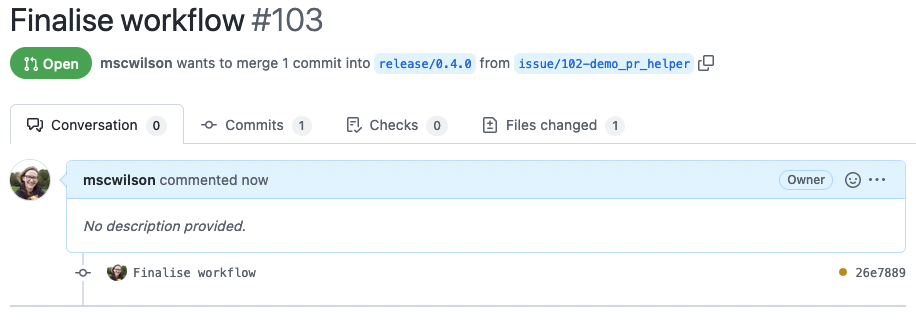
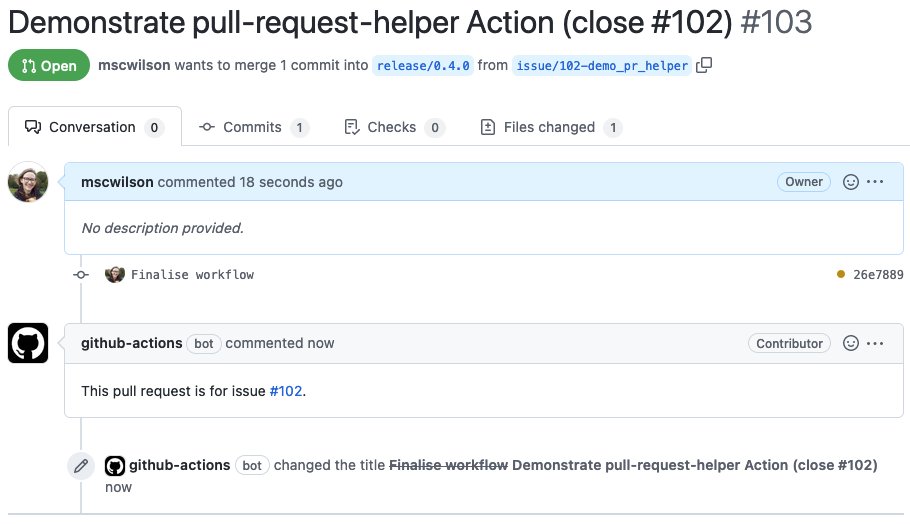
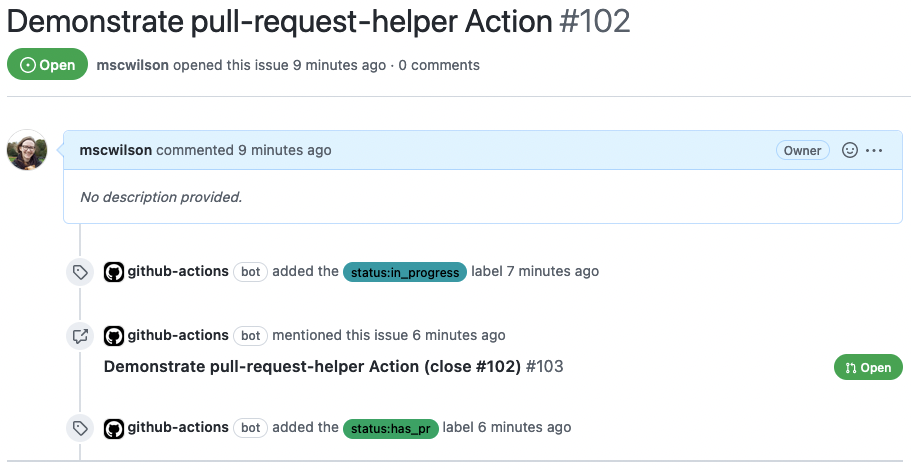

# Pull Request Helper Action

Link a PR with its issue. Relies on the PR being opened from an `issue/<number>-text` branch into a `release/<number>` branch.

## Using the Action
Add a workflow like this to your repo (in `.github/workflows`):

```yaml
name: "Admin"
on:
  pull_request:
    types:
      - opened
    branches:
      - 'release/**'

jobs:
  link-pr-issue:
    runs-on: ubuntu-latest
    steps:
      - name: Checkout
        uses: actions/checkout@v3

      - name: Update issue status labels
        uses: snowplow-incubator/pull-request-helper-action@v1
        env:
          ACCESS_TOKEN: ${{ secrets.GITHUB_TOKEN }}
```

## What happens when the workflow is triggered?
When a pull request is opened from `issue` branch to `release` branch, the default PR title is the most recent commit in the issue branch.

Example PR before the Action runs:  


This Action finds the issue number in the issue branch name, e.g. issue #123 from branch `issue/123-words`, and then does two things:
1. Renames the PR, to the issue title plus `(close #<number>)`
2. Writes a comment containing the issue reference

The comment will show up as a mention in the issue, meaning that the linked PR can be easily found.

Example PR after the Action runs:


The example issue:  


The status labels here were added by the [Labels Helper Action](https://github.com/snowplow-incubator/labels-helper-action) - see below.

### If it's triggered by something irrelevant
The action will just end without doing anything - it won't throw an error, it will still have a green tick.


## Using the Labels Helper and Pull Request Helper actions together
The [Labels Helper Action](https://github.com/snowplow-incubator/labels-helper-action) adds status labels to issues. Use them in one workflow like this:

```yaml
name: "Admin"
on:
  create:
  pull_request:
    types:
      - opened
    branches:
      - "release/**"
  push:
    branches:
      - "release/**"

jobs:
  update-labels:
    runs-on: ubuntu-latest
    steps:
      - name: Checkout
        uses: actions/checkout@v3

      - name: Update issue status labels
        uses: snowplow-incubator/labels-helper-action@v1
        env:
          ACCESS_TOKEN: ${{ secrets.GITHUB_TOKEN }}

  link-pr-issue:
    runs-on: ubuntu-latest
    if: github.event_name == "pull_request"
    steps:
      - name: Checkout
        uses: actions/checkout@v3

      - name: Match the issue to the PR
        uses: snowplow-incubator/pull-request-helper-action@v1
        env:
          ACCESS_TOKEN: ${{ secrets.GITHUB_TOKEN }}
```
